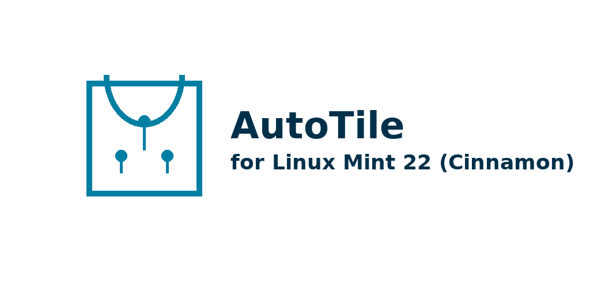

 <p align="center">
  
</p>

<h1 align="center">AutoTile for Linux Mint 22 (Cinnamon)</h1>

<p align="center"><i>Snap your windows. Boost your flow.</i></p>

<p align="center">
  
  
  
</p>

---

**AutoTile** is a lightweight Python script that adds simple tiling window management to Linux Mint 22 (Cinnamon/X11).  
It arranges **visible, normal** windows into a neat grid using `wmctrl` + `xprop`. Zero learning curve, no switch to i3/bspwm.

---

## ✨ Features

- Auto-grid layout (defaults to √n columns).
- Skips minimized/hidden windows.
- Respects Cinnamon panels (tiles within the work area).
- Adjustable gap between windows.
- Optional fixed number of columns (e.g., always 2).
- Ignore specific apps by class/title.
- Bind to a hotkey for instant tiling.

---

## 📦 Requirements

- Linux Mint 22 (Cinnamon) on **X11**
- `wmctrl`, `xprop` (`x11-utils`), `x11-xserver-utils`

Install on Mint:
```bash
sudo apt update
sudo apt install -y wmctrl x11-utils x11-xserver-utils
```

---

## 🚀 Quick Install

Clone and run the installer:

```bash
git clone https://github.com/YOURNAME/autotile-mint.git
cd autotile-mint
chmod +x setup.sh
./setup.sh
```

This will:
- install dependencies (APT) if missing,
- place the script at `~/.local/bin/autotile`,
- create a menu launcher (`~/.local/share/applications/autotile.desktop`).

Run it:
```bash
autotile
```

Bind to a hotkey:
- **System Settings → Keyboard → Shortcuts → Custom Shortcuts**
- Command: `autotile`
- Suggested key: **Super+T**

---

## 🧠 How It Works

AutoTile enumerates windows with `wmctrl -l`, filters only **normal**, **visible**, **current-workspace** windows using `xprop`, computes a grid (√n by default), and moves/resizes with `wmctrl -e`. It uses the **work area** from `wmctrl -d` so panels aren’t covered.

---

## ⚙️ Configuration

Open `autotile.py` and tweak the values at the top:

```python
GAP = 10          # pixels between windows
FORCE_COLS = 0    # set >0 to force a fixed column count, 0 = auto
IGNORE_APPS = ["Spotify", "Calculator"]  # match WM_CLASS or title (case-insensitive)
```

Examples:
- Force two columns always: `FORCE_COLS = 2`
- Wider spacing: `GAP = 16`
- Ignore more apps: add names to `IGNORE_APPS`

---

## 🧪 Usage Examples

- 2 windows open → side-by-side split.  
- 3–4 windows → 2×2 grid.  
- 5–6 windows → 3×2 grid.  
- Minimizing a window → excluded from tiling.  
- Sticky windows (on all desktops) → included.  

---

## 🛠 Troubleshooting

- **Nothing moves?**  
  - Ensure you’re on **X11** (Wayland isn’t supported by `wmctrl`).  
  - Check `wmctrl -l` outputs windows.  

- **Panels get covered?**  
  - Make sure Cinnamon panels are enabled; AutoTile reads the work area from `wmctrl -d`.  

- **A window keeps getting tiled but you don’t want it to:**  
  - Add part of its `WM_CLASS` or title to `IGNORE_APPS`.  
  - Find classes/titles with:  
    ```bash
    xprop | grep -E 'WM_CLASS|WM_NAME'
    ```  
    (Click the window after running `xprop`.)  

---

## 📁 Repo Layout

```
autotile-mint/
├─ autotile.py       # main script
├─ setup.sh          # installer to ~/.local/bin and .desktop
├─ README.md
├─ LICENSE           # MIT (recommended)
└─ .gitignore
```

Suggested local convention:
- `~/projects/` → polished repos you push to GitHub  
- `~/devs/`     → experiments/WIP you don’t publish yet  

---

## 🤝 Contributing

Issues and PRs welcome:
- feature requests (column presets, per-workspace configs),
- bug reports (DE/driver quirks),
- Wayland alternatives (PRs with sway/hyprland helpers).

---

## 📝 License

MIT. See `LICENSE` for details.
